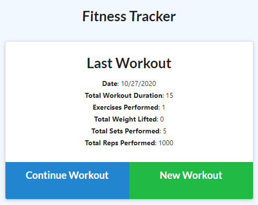
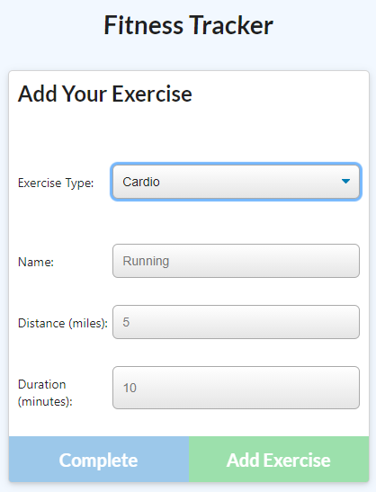
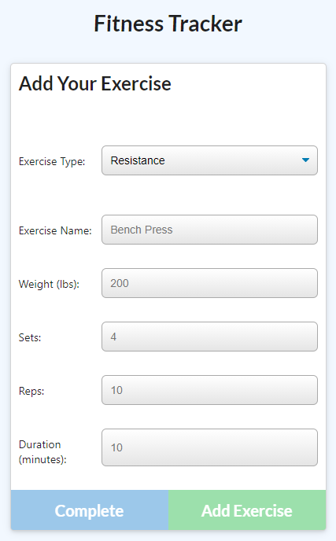
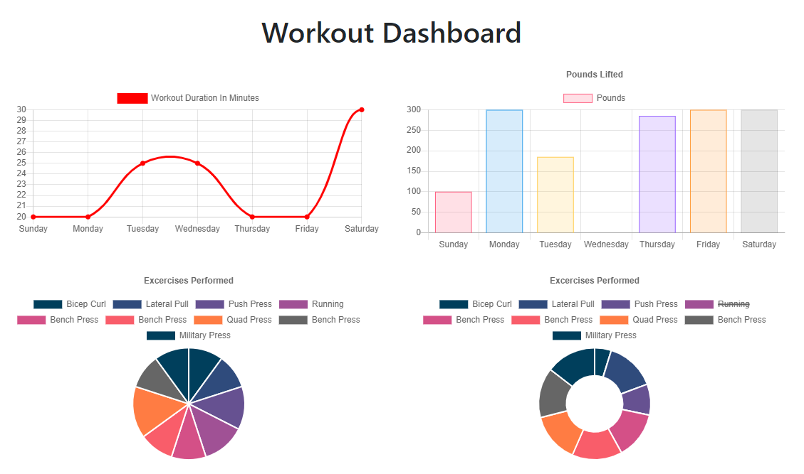

# Fitness Tracker

[Deployed Site](https://murmuring-spire-59899.herokuapp.com/)
  

## Description

A fitness tracking application utilizing Express & MongoDB with Mongoose.

## Table of Contents
  
*  [Usage](#usage)

*  [Contributing](#contributing)

*  [Support](#support)

*  [License](#license)

## Usage

From the main page the user is presented with information from the most recent workout session. Clicking "Continue Workout" allows the user to update the current workout session. Clicking "New Workout" presents the user with a new workout session.

User can select the exercise type they would like to add to the current workout session, resistance or cardio.

Cardio tracks the type, distance in miles, and duration of the exercise.

Resistance tracks the name, weight in pounds, number of sets and reps, and the duration of the exercise.

The dashboard link at the top of the page takes the user to the stats page where all excercises and workouts are graphed in tables and pie charts tracked by date.

  

## Contributing

No contributions are currently being accepted for this project.

## Support

For support regarding this project please contact me via GitHub

## License

This project is licensed under the MIT License.